# 🚀 AI Career Guidance Platform

> **An AI-powered full-stack career platform for students** — resume analysis, skill-gap detection, career roadmaps, live job discovery, AI assistance, mock interviews, Google authentication, profiles and placement-readiness insights in one modern web application.

---

## ✨ Project Overview

The **AI Career Guidance Platform** is a full-stack Flask application designed to help college students move from **resume preparation → skill analysis → career planning → job discovery → interview preparation**.

The backend uses Flask with MySQL, environment-based configuration, Google OAuth, Gemini AI and external job APIs. The current application includes resume PDF validation/analysis, detected skills, missing-skill recommendations, career suggestions, job matching and an AI career assistant. fileciteturn1file1L174-L216

---

## 🖼️ Project Output Preview


> **Project output showcase:** This visual presents the main application areas represented by the current project scope: Home, Dashboard, Resume Analyzer, Skill Gap Analysis, Jobs, AI Career Assistant, Mock Interview, Profile and responsive/mobile views.

### Main Screens

| Screen | Preview |
|---|---|
| 🏠 Home | `docs/images/project-overview.png` |
| 📊 Dashboard | `docs/images/project-overview.png` |
| 📄 Resume Analyzer | `docs/images/project-overview.png` |
| 🎯 Skill Gap Analysis | `docs/images/project-overview.png` |
| 💼 Job Opportunities | `docs/images/project-overview.png` |
| 🤖 AI Career Assistant | `docs/images/project-overview.png` |
| 🎤 Mock Interview | `docs/images/project-overview.png` |
| 👤 Profile | `docs/images/project-overview.png` |

> For an exact screenshot of every live page, replace the showcase image with screenshots captured from the running application.

## 🖥️ Individual Project Screens

Each major application screen is provided separately so the GitHub README stays clean, visual and professional.

### 🏠 Home Page
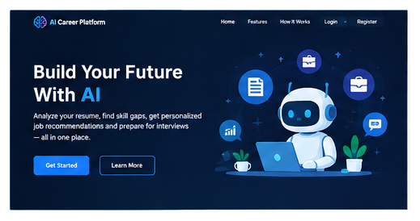

### 🔐 Login Page
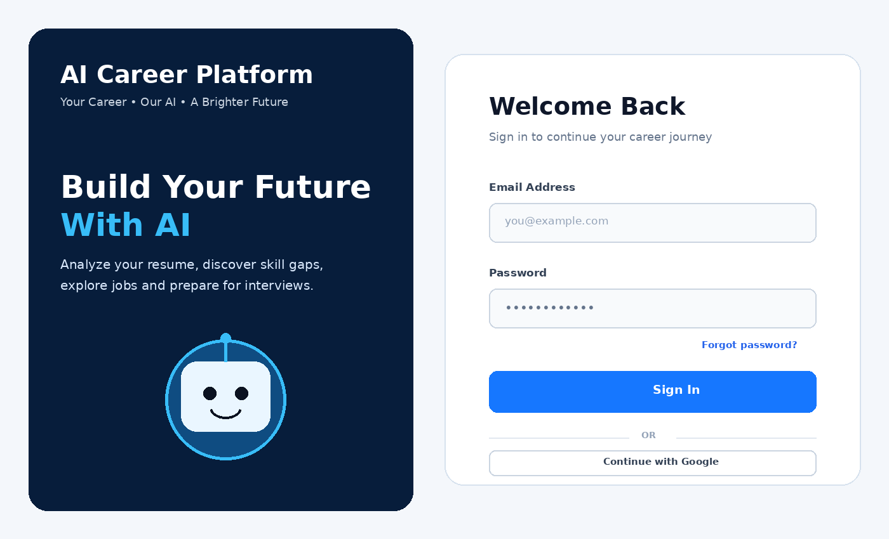

### 📊 Dashboard
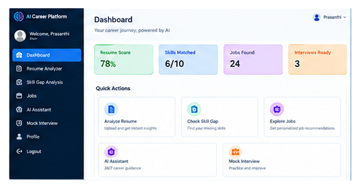

### 📄 Resume Analyzer
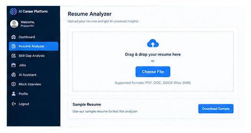

### 🎯 Skill Gap Analysis
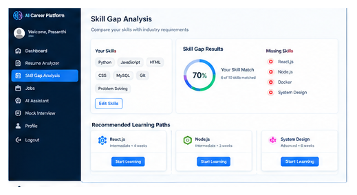

### 💼 Job Opportunities
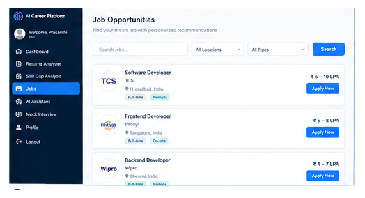

### 🤖 AI Career Assistant
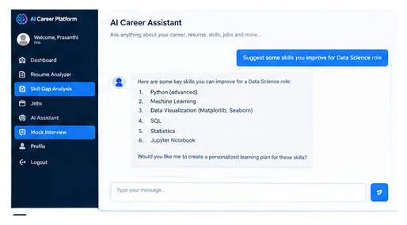

### 🎤 Mock Interview
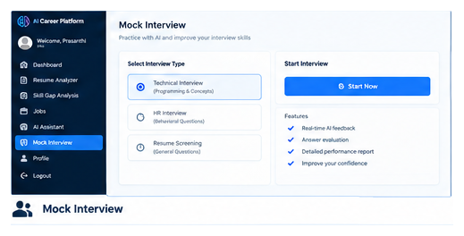

### 👤 Profile
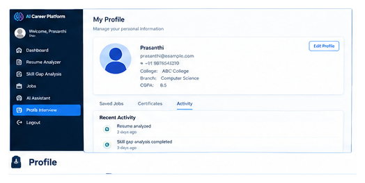

### 📱 Responsive / Mobile View
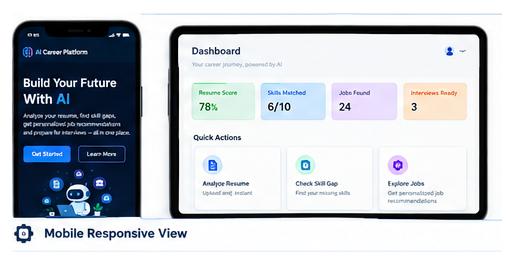

## 🖼️ Product Preview

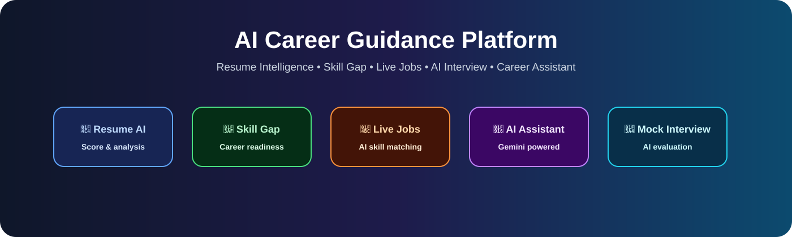

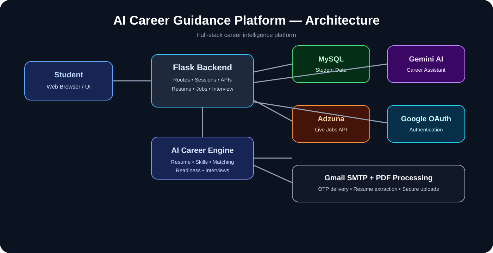


> Add your actual screenshots to `docs/images/` using the filenames below. GitHub will automatically render them after you push the images.

### 🏠 Home / Landing Page


### 📊 Student Dashboard


### 📄 AI Resume Analyzer


### 💼 AI-Matched Jobs


### 🎯 Skill Gap & Career Roadmap


### 🤖 AI Career Assistant


### 🎤 Mock Interview


---

## 🌟 Key Features

| Feature | Description |
|---|---|
| 🔐 Authentication | Student registration, login, sessions and Google OAuth |
| 📧 OTP Password Reset | Gmail SMTP based OTP flow |
| 📄 Resume Analyzer | Upload and analyze PDF resumes |
| 🧠 AI Assistant | Gemini-powered career Q&A |
| 🧩 Skill Detection | Detects technical skills from resumes |
| 📈 Resume Score | Calculates resume quality using skills, structure and profile information |
| 🎯 Placement Readiness | Generates a placement-readiness score |
| 🛠️ Skill Gap Analysis | Compares current skills with career requirements |
| 🗺️ Career Roadmaps | Career-specific skills and learning paths |
| 💼 Live Job Search | Fetches jobs through the Adzuna API |
| 🎯 Job Skill Matching | Matches detected resume skills against job descriptions |
| 🎤 Mock Interview | Evaluates communication, technical knowledge, relevance and confidence |
| 👤 Student Profile | Profile, education, skills, projects and professional links |
| 📁 Resume Storage | Securely generated filenames for uploaded resumes |
| 🔌 Modular Backend | Flask Blueprints for auth, students, jobs, resume and interview modules |

The code registers dedicated Flask blueprints for authentication, student, jobs, resume and interview functionality. fileciteturn1file1L204-L216 fileciteturn1file1L262-L267

---

## 🧠 AI & Resume Intelligence

The platform uses the Google Gemini API through the `google-genai` SDK. The AI assistant sends a focused career-assistance prompt and returns concise responses for students. fileciteturn1file0L31-L59

The resume analyzer:

- accepts PDF resumes
- validates that the uploaded file is a PDF
- extracts text using `pypdf`
- detects email, phone, GitHub and LinkedIn information
- detects technical skills
- identifies resume sections
- calculates skill and structure scores
- identifies missing skills
- generates career suggestions
- stores the analysis result in MySQL

The application currently includes skill patterns for technologies such as Python, Java, C++, HTML, CSS, JavaScript, React, Flask, Django, MySQL, Machine Learning, Pandas, NumPy, TensorFlow, PyTorch, Git, GitHub, Docker, AWS and Azure. fileciteturn0file0L683-L743

---

## 💼 Live Job Intelligence

The jobs module integrates with the **Adzuna Jobs API** and supports career-oriented searches such as:

- Frontend Developer
- Backend Developer
- Python Developer
- Python Full Stack Developer
- Full Stack Developer
- AI / Machine Learning Engineer
- Data Scientist
- Data Analyst
- Database / SQL Developer
- Cloud Engineer
- Software Developer

The backend can retrieve live job data, process company/location/salary details and calculate a resume-skill match percentage against each job description. fileciteturn1file5L797-L894 fileciteturn1file7L1152-L1327

---

## 🎤 AI Mock Interview

Students can select a target career and submit interview answers.

The evaluation pipeline currently calculates:

- Communication
- Technical knowledge
- Relevance
- Confidence
- Overall score
- Readiness status
- Strengths
- Improvement areas

The result is stored in the session for the student's interview experience. fileciteturn1file9L1644-L1772

---

## 🔐 Authentication & Security

Google OAuth is integrated using Authlib and OpenID Connect. The callback retrieves the user's Google profile information and establishes the application session. fileciteturn1file2L329-L354

Gmail SMTP is used for password-reset OTP delivery. The current backend uses `MAIL_USERNAME` and `MAIL_PASSWORD` from application configuration. fileciteturn1file4L644-L692

### ⚠️ Never commit secrets

Create a local `.env` file:

```env
SECRET_KEY=replace-with-a-long-random-secret
GEMINI_API_KEY=your-gemini-api-key

GOOGLE_CLIENT_ID=your-google-client-id
GOOGLE_CLIENT_SECRET=your-google-client-secret

MAIL_USERNAME=your-email@gmail.com
MAIL_PASSWORD=your-google-app-password

ADZUNA_APP_ID=your-adzuna-app-id
ADZUNA_APP_KEY=your-adzuna-app-key

DB_HOST=localhost
DB_PORT=3306
DB_NAME=ai_career_platform
DB_USER=root
DB_PASSWORD=your-database-password
```

Add `.env` to `.gitignore`:

```gitignore
.env
__pycache__/
*.pyc
```

**Never upload API keys, OAuth secrets, Gmail App Passwords or database passwords to GitHub.**

---

## 🏗️ Architecture

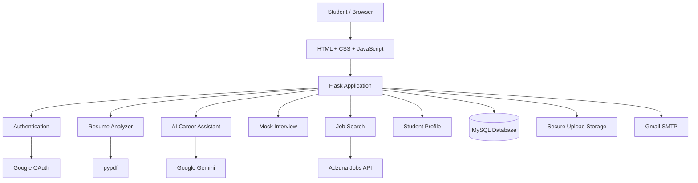

---

## 📁 Recommended Project Structure

```text
AI-Career-Guidance-Platform/
│
├── app.py
├── config.py
├── requirements.txt
├── README.md
├── .env
├── .gitignore
│
├── database/
│   └── db.py
│
├── routes/
│   ├── auth.py
│   ├── student.py
│   ├── jobs.py
│   ├── resume.py
│   └── interview.py
│
├── templates/
│   ├── index.html
│   ├── login.html
│   ├── register.html
│   ├── dashboard.html
│   ├── resume.html
│   ├── jobs.html
│   ├── interview.html
│   ├── profile.html
│   └── ...
│
├── static/
│   ├── css/
│   ├── js/
│   ├── images/
│   └── uploads/
│
└── docs/
    └── images/
        ├── home.png
        ├── dashboard.png
        ├── resume-analyzer.png
        ├── jobs.png
        ├── skill-gap.png
        ├── ai-assistant.png
        └── mock-interview.png
```

---

## 🛠️ Technology Stack

### Frontend

- HTML5
- CSS3
- JavaScript
- Responsive UI
- Fetch API / AJAX-style API communication

### Backend

- Python
- Flask
- Flask Blueprints
- Jinja Templates
- Session-based authentication
- REST-style JSON endpoints

### Database

- MySQL
- `mysql-connector-python`

### AI

- Google Gemini
- `google-genai`

### Authentication

- Authlib
- Google OAuth 2.0
- OpenID Connect

### Resume Processing

- pypdf
- Python regular expressions

### External Services

- Adzuna Jobs API
- Gmail SMTP
- Google OAuth
- Google Gemini API

---

## ⚙️ Installation

### 1. Clone the repository

```bash
git clone https://github.com/YOUR_USERNAME/AI-Career-Guidance-Platform.git
cd AI-Career-Guidance-Platform
```

### 2. Create a virtual environment

Windows:

```powershell
python -m venv venv
venv\Scripts\activate
```

macOS/Linux:

```bash
python3 -m venv venv
source venv/bin/activate
```

### 3. Install dependencies

```bash
pip install -r requirements.txt
```

### 4. Configure environment variables

Create:

```text
.env
```

and add the required credentials.

### 5. Configure MySQL

Create the required MySQL database and configure the database connection values in your environment/configuration.

### 6. Run the application

```bash
python app.py
```

Open:

```text
http://127.0.0.1:5000
```

---

## 🚀 Production Deployment

For production deployment, use a WSGI server such as Gunicorn.

```bash
gunicorn app:app
```

Typical Render configuration:

**Build Command**

```bash
pip install -r requirements.txt
```

**Start Command**

```bash
gunicorn app:app
```

Set all secrets as **Environment Variables** in the hosting provider rather than committing `.env` to GitHub.

---

## 🔑 Required API Credentials

| Service | Environment Variable |
|---|---|
| Gemini | `GEMINI_API_KEY` |
| Google OAuth | `GOOGLE_CLIENT_ID` |
| Google OAuth | `GOOGLE_CLIENT_SECRET` |
| Gmail SMTP | `MAIL_USERNAME` |
| Gmail SMTP | `MAIL_PASSWORD` |
| Adzuna | `ADZUNA_APP_ID` |
| Adzuna | `ADZUNA_APP_KEY` |
| Flask | `SECRET_KEY` |
| MySQL | `DB_HOST`, `DB_PORT`, `DB_NAME`, `DB_USER`, `DB_PASSWORD` |

---

## 🔄 Application Flow

```text
Student
   ↓
Register / Google Login
   ↓
Student Dashboard
   ↓
Upload Resume
   ↓
PDF Text Extraction
   ↓
Skill + Structure + Contact Analysis
   ↓
Resume Score + Placement Readiness
   ↓
Career Recommendation
   ↓
Skill Gap Analysis
   ↓
Career Roadmap
   ↓
Live Job Search
   ↓
Resume ↔ Job Skill Matching
   ↓
AI Mock Interview
   ↓
Interview Evaluation
```

---

## 📊 Resume Scoring Model

The current implementation combines:

```text
Skill Score       → 40%
Structure Score   → 35%
Contact Score     → 15%
Profile Score     → 10%
```

The backend then constrains the resulting score to a 0–100 range. fileciteturn0file0L873-L975

Placement-readiness calculation uses:

```text
Skill Score       → 45%
Structure Score   → 25%
Contact Score     → 15%
Profile Score     → 15%
```

fileciteturn0file0L997-L1015

---

## 🎯 Career Skill Gap

The platform contains career-specific skill requirements for roles including Frontend Developer, Backend Developer, Python Full Stack Developer, AI/ML Engineer, Data Scientist, Cloud Engineer, Database/SQL Developer and Software Developer. fileciteturn1file3L490-L575

The skill-gap module compares detected resume skills with the target career requirements and calculates readiness based on the number of matched skills. fileciteturn1file3L577-L634

---

## 🧪 Testing Checklist

Before deployment, verify:

- [ ] Registration works
- [ ] Login works
- [ ] Google login works
- [ ] Logout works
- [ ] Forgot password OTP works
- [ ] Resume PDF upload works
- [ ] Invalid/non-PDF upload is rejected
- [ ] Resume analysis is saved
- [ ] Skill-gap analysis works
- [ ] Career roadmap loads
- [ ] Live jobs load
- [ ] Job filters work
- [ ] AI assistant responds
- [ ] Mock interview works
- [ ] Interview evaluation works
- [ ] Profile update works
- [ ] Uploaded files are protected
- [ ] Environment variables work
- [ ] Production start command works

---

## 🔒 Production Security Checklist

Before making the project public:

- Use a strong random `SECRET_KEY`
- Never commit `.env`
- Never expose Gemini, Adzuna or Google OAuth secrets
- Use Gmail App Password instead of a normal Gmail password
- Use HTTPS in production
- Configure Google OAuth production redirect URI
- Restrict uploaded file types and sizes
- Keep user uploads outside public directories when possible
- Use password hashing for production authentication
- Validate and sanitize user input
- Use database least-privilege credentials
- Disable Flask debug mode in production

> **Important:** The currently uploaded `app.py` contains a hard-coded `app.config["SECRET_KEY"] = "AI_CAREER_PLATFORM"` after loading the environment secret. For production, remove that hard-coded assignment so the environment-based secret is actually used. fileciteturn1file1L232-L250

---

## 👨‍💻 Developer

**AI Career Guidance Platform**

Built as a full-stack student career-support platform combining:

**Web Development + AI + Resume Intelligence + Job Search + Interview Preparation**

---

## 📄 License

Add your preferred license before publishing the repository.

Example:

```text
MIT License
```

---

## ⭐ Show Your Support

If this project helps you:

```text
⭐ Star the repository
🍴 Fork the project
🐛 Report issues
💡 Suggest improvements
```

---

## 📌 Future Enhancements

- AI-generated resume rewriting
- ATS keyword optimization
- Persistent interview history
- Personalized learning recommendations
- Course recommendations
- Job application tracking
- Email notifications
- Admin analytics dashboard
- Docker deployment
- CI/CD pipeline
- Automated testing
- Cloud object storage for resumes
- Production-grade password hashing and account security
